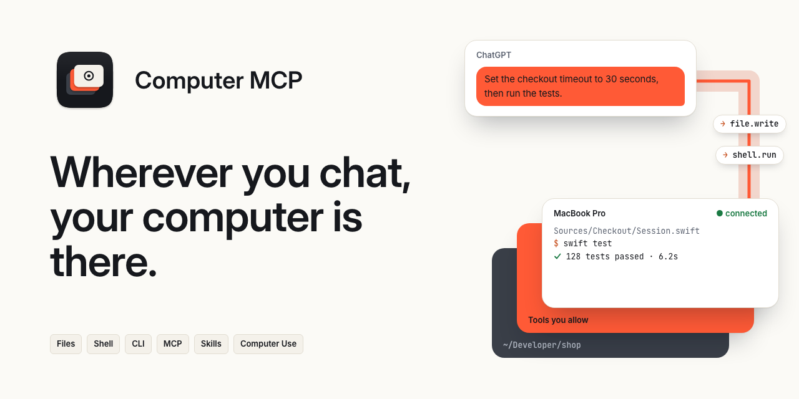

# Computer MCP product website

This repository owns the static product website published at
[computer-mcp.github.io](https://computer-mcp.github.io/): the homepage and the
[setup guide](https://computer-mcp.github.io/guide/). Product code, architecture, operator
documentation, issues, and releases live in the
[main Computer MCP repository](https://github.com/computer-mcp/computer-mcp).

The site is intentionally independent from the Swift repository. It has its own static build,
accessibility checks, browser-behavior tests, link validation, and GitHub Pages deployment. It does
not use a custom domain.

## Local development

Use Node.js 22 or newer and Python 3.11 or newer:

```sh
npm ci
npm run dev
```

Run every repository gate:

```sh
npm run test:install
npm run check
```

`npm run check` verifies the bundled fonts, the release record and the catalog policy, then checks
formatting and HTML, builds the site, validates links and runs the browser tests.

The production build is written to `dist/`. GitHub Pages deploys only that artifact from the
official repository's `master` branch after validation and catalog reconciliation.

Link validation retries transient HTTP errors with bounded concurrency. When an official GitHub
repository, file, directory, release or security-policy link returns a server error, it verifies the
corresponding public target through the GitHub API. Client errors, missing targets and API failures
still fail validation. `GH_TOKEN` or `GITHUB_TOKEN` can provide API authentication; the token is
sent only to the GitHub API. Workflows use their repository token for read-only API requests.
Content verification covers `main`, `master` and full commit hashes; other content refs retain HTTP
validation.

`public/release.json` binds the deployed site to the product's delivered commit and release tag. The
private website package version describes this build project, not the product version. After the
main repository publishes an accepted release, run `npm run release:update -- vX.Y.Z` to import its
`release.json` asset. The importer verifies the official repository, public stable release, tag
commit and GitHub asset digest; it refuses version regressions and changed identities for an
existing version. It never derives a release from an installed App or local source checkout. Commit
the generated record with the website delivery.

`npm run release:check` checks the local record without changing it.
`npm run release:verify-public -- vX.Y.Z` also compares it with the official public asset.
Historical releases without a delivery-record asset retain their existing record until the next
product delivery. Tests read the record rather than maintain another product-version constant.

The plugin catalog publisher generates a separate versioned snapshot of verified current official
plugin releases: the latest stable and any newer prerelease for each repository. Host and plugin
releases are paired; discovery does not offer historical compatibility fallback. Run
`npm run catalog:update -- --use-gh-auth` to produce `public/plugins/index.json` using existing
GitHub CLI authentication, or provide `GH_TOKEN`/`GITHUB_TOKEN` in the process environment. The
publisher also works without authentication within GitHub's public API limits. It downloads and
verifies release archives without running package code. `npm run catalog:check-policy` and
`npm run catalog:test` run offline; `npm run catalog:check` validates a generated snapshot.
Automatic publication requires a complete verified snapshot committed to `master`; a missing seed
fails Pages publication before upload and preserves the deployed site. Runs reconcile hourly, on
source pushes and on manual workflow dispatch, merge changed generations through an auto-merged pull
request and deploy one complete artifact. See [the plugin catalog contract](docs/plugin-catalog.md)
for provenance, withdrawals, resource bounds, atomic updates and installation trust.

## Content boundaries

- Keep claims aligned with behavior demonstrated in the main repository.
- Label advanced Codex orchestration as experimental.
- Present official Codex Remote as the preferred first-party choice for ordinary remote Codex
  control.
- Do not add testimonials, customer logos, usage statistics, or compatibility claims without
  verifiable evidence.
- Keep the security model explicit: gateway policy decides whether a capability is available;
  consent decides whether an allowed higher-risk action may proceed now.

See [CONTRIBUTING.md](CONTRIBUTING.md) before opening a change.

## Brand and copy

The organization [DESIGN.md](https://github.com/computer-mcp/.github/blob/master/DESIGN.md) owns
tokens, typography, the mark and the plane compositions; `src/styles.css` implements them for the
web.
[Product Identity](https://github.com/computer-mcp/computer-mcp/blob/master/Documentation/Architecture/ProductIdentity.md)
owns positioning and the tagline “Wherever you chat, your computer is there.”
(「聊天在哪，你的电脑就在哪。」). Main-repository documentation owns capability, permission and
connection facts; website copy follows it. The comparison section carries the date its external
facts were verified and their sources.

Pages are written in Chinese. English text lives in `data-en`, `data-en-href` and `data-en-content`
attributes; the language toggle remembers the choice, and `?lang=en` or `?lang=zh-CN` selects one
directly.

`public/brand/` and `.github/brand/brand.lock.json` are imports from the organization repository.
Update them from an organization checkout with `python3 Brand/brand.py sync <website-checkout>` and
commit the result. CI verifies the lock with the organization's shared brand check.

Text uses the visitor's system fonts: SF Pro, SF Mono and PingFang SC on Apple devices. The site
bundles no font files.

## License

Computer MCP-owned website code and content use the
[Functional Source License 1.1, Apache 2.0 Future License](LICENSE) (FSL-1.1-ALv2).
